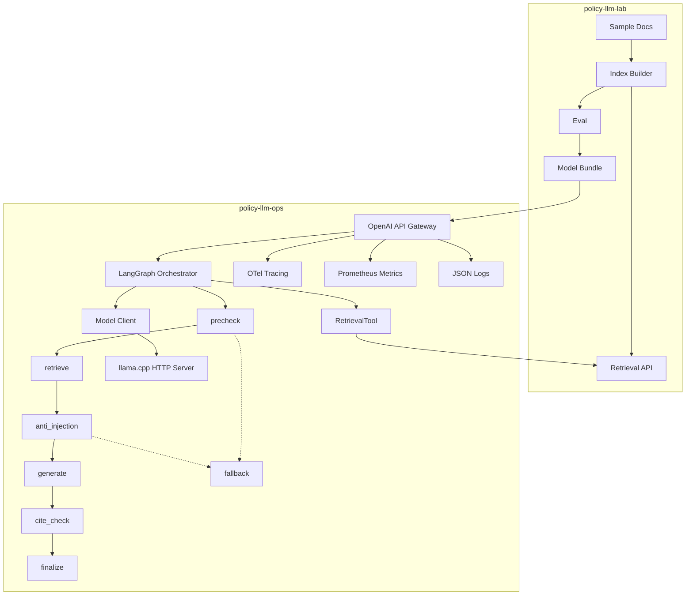

# Local-First LLMOps Monorepo (Policy)

Production-grade, local-first LLMOps system with a Lab pipeline (ingest → index → eval → release) and Ops runtime (gateway → LangGraph agent → observability → canary/rollback). Runs on macOS with Docker and supports local inference via llama.cpp (GGUF).

## One-command demo
```bash
make up
```
Then call the OpenAI-compatible gateway:
```bash
curl http://localhost:8000/v1/chat/completions \
  -H 'Content-Type: application/json' \
  -d '{"model":"local-llama-gguf","messages":[{"role":"user","content":"What is RAG?"}]}'
```

By default the gateway uses a mock model for fast local demo. To enable llama.cpp inference:
```bash
LLM_PROVIDER=llama_cpp docker compose --profile llama up --build
```
Place a real GGUF model at `policy-llm-lab/artifacts/model/model.gguf` before starting llama.cpp.

## Architecture


## Repo layout
- `policy-llm-lab/` — ingest, index, eval, release artifacts
- `policy-llm-ops/` — gateway, LangGraph agent runtime, observability, canary/rollback
- `contracts/` — JSON schemas for model_card and eval_report
- `infra/` — docker, kind, helm assets

## Contracts
Artifacts emitted by `policy-llm-lab`:
- `manifest.json` (release bundle manifest)
- `model/model_card.json`
- `model/model.gguf`
- `eval/eval_report.json`
- `index/index.sqlite`

Schemas live in `policy-llm-lab/contracts/` (and are mirrored in `contracts/` for ops validation).

Release bundle layout (`policy-llm-lab/dist/<release_id>/`):
```
dist/<release_id>/
  manifest.json
  model/
    model_card.json
    model.gguf
  index/
    index.sqlite
  eval/
    eval_report.json
  contracts/
    manifest.schema.json
    model_card.schema.json
    eval_report.schema.json
  meta/
    sbom.json
    checksums.json
    attestation.json
    CHANGELOG.md
```

## Observability
- Traces: Jaeger at `http://localhost:16686`
- Metrics: Prometheus at `http://localhost:9090`
- Logs: JSON to stdout (ready for Loki)

Metrics exposed by gateway:
- `request_count`, `error_rate`, `latency_histogram`, `ttft_ms`, `tokens_in`, `tokens_out`,
  `tool_call_success_rate`, `retrieval_hit_rate`, `citation_coverage`

## Canary/rollback
`policy-llm-ops` reads `eval_report.json` and:
- If `pass=true`, starts canary at 5% traffic
- Promotes if runtime SLO holds
- Auto-rolls back if p95 latency regresses >20%, error rate >2%, tool success <95%, or
  citation coverage < threshold

## Dev workflows
```bash
make release   # generate eval + model card artifacts
make test      # unit/component/contract tests for lab + ops
make lint      # lint only
make contract-all  # build lab release + run ops contract tests
make test-integration  # docker compose integration tests
make e2e       # canary rollback simulation
make loadtest  # load test + report (p50/p95/p99, RPS, error rate)
make kind-up   # kind cluster + helm install
```

Load test overrides:
```bash
LOADTEST_REQUESTS=500 LOADTEST_CONCURRENCY=40 LOADTEST_OUTPUT=logs/loadtest_report.json make loadtest
```
The report is printed to stdout and saved as JSON (default: `logs/loadtest_report.json`).

## Release bundle demo
```bash
make -C policy-llm-lab release RELEASE_ID=local-dev
RELEASE_PATH=policy-llm-lab/dist/local-dev LLM_PROVIDER=mock make up
```

The gateway validates the bundle, gates on `eval_report.pass`, and runs canary routing at 5%.

## How to scale this

Start by scaling replicas, then tune runtime limits. Use these knobs together:

| Area | Knob | Default | Effect |
|---|---|---:|---|
| Gateway concurrency | `GATEWAY_MAX_INFLIGHT` | `64` | Max concurrent in-flight requests per instance |
| Gateway backlog | `GATEWAY_MAX_QUEUE` | `256` | Max pending requests before immediate 503 |
| Queue latency cap | `GATEWAY_QUEUE_TIMEOUT_MS` | `250` | Max wait for an inflight slot before 503 |
| Model timeout | `LLAMA_TIMEOUT_S` | `30` | Upper bound for one llama.cpp call |
| Model retries | `LLAMA_MAX_RETRIES` | `1` | Retry count for transient model failures |
| Retry backoff | `LLAMA_RETRY_BACKOFF_MS` | `100` | Exponential retry base delay |
| Retrieval breadth | `RETRIEVAL_TOP_K` | `3` | Retrieved context count (quality/latency tradeoff) |
| Canary pressure | `CANARY_MIN_SAMPLES` / `CANARY_SLO_WINDOW` | `30` / `200` | Rollout sensitivity and stabilization window |

Recommended scaling order:
1. Scale out gateway replicas.
2. Increase `GATEWAY_MAX_INFLIGHT` gradually while watching p95/p99.
3. Keep queue bounds tight; avoid masking overload with a deep queue.
4. Tune retry limits only after confirming upstream model stability.
5. Adjust `RETRIEVAL_TOP_K` only if quality metrics justify added latency.

Supporting docs:
- `docs/failure-modes.md`
- `docs/design-tradeoffs.md`

## Notes
- TTFT is approximated for non-streaming llama.cpp calls (same as latency).
- Logs intentionally exclude user content and redact emails/phones/numbers.
- Prompt sampling is disabled by default; enable with `PROMPT_SAMPLE_RATE`.
