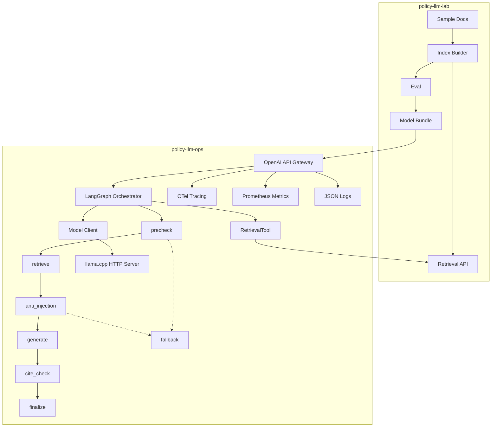

# Local-First LLMOps Monorepo (Policy)

Production-grade, local-first LLMOps system with a Lab pipeline (ingest → index → eval → release) and Ops runtime (gateway → LangGraph agent → observability → canary/rollback). Runs on macOS with Docker and supports local inference via llama.cpp (GGUF).

## One-command demo
```bash
make up
```
Then call the OpenAI-compatible gateway:
```bash
curl http://localhost:8000/v1/chat/completions \
  -H 'Content-Type: application/json' \
  -d '{"model":"local-llama-gguf","messages":[{"role":"user","content":"What is RAG?"}]}'
```

By default the gateway uses a mock model for fast local demo. To enable llama.cpp inference:
```bash
LLM_PROVIDER=llama_cpp docker compose --profile llama up --build
```
Place a real GGUF model at `policy-llm-lab/artifacts/model/model.gguf` before starting llama.cpp.

## Architecture


## Repo layout
- `policy-llm-lab/` — ingest, index, eval, release artifacts
- `policy-llm-ops/` — gateway, LangGraph agent runtime, observability, canary/rollback
- `contracts/` — JSON schemas for model_card and eval_report
- `infra/` — docker, kind, helm assets

## Contracts
Artifacts emitted by `policy-llm-lab`:
- `model.gguf` (placeholder if not present)
- `model_card.json`
- `eval_report.json`
- `manifest.json` (release bundle manifest)

Schemas live in `policy-llm-lab/contracts/` (and are mirrored in `contracts/` for ops validation).

Release bundle layout (`policy-llm-lab/release/`):
```
release/
  manifest.json
  model/
    model.gguf
    model_card.json
    eval_report.json
  index/
    index.sqlite
```

## Observability
- Traces: Jaeger at `http://localhost:16686`
- Metrics: Prometheus at `http://localhost:9090`
- Logs: JSON to stdout (ready for Loki)

Metrics exposed by gateway:
- `request_count`, `error_rate`, `latency_histogram`, `ttft_ms`, `tokens_in`, `tokens_out`,
  `tool_call_success_rate`, `retrieval_hit_rate`, `citation_coverage`

## Canary/rollback
`policy-llm-ops` reads `eval_report.json` and:
- If `pass=true`, starts canary at 5% traffic
- Promotes if runtime SLO holds
- Auto-rolls back if p95 latency regresses >20%, error rate >2%, tool success <95%, or
  citation coverage < threshold

## Dev workflows
```bash
make release   # generate eval + model card artifacts
make test      # lint, typecheck, unit + integration tests
make lint      # lint only
make loadtest  # basic load test against gateway
make kind-up   # kind cluster + helm install
```

## Release bundle demo
```bash
cd policy-llm-lab
python -m llm_lab.release.packager
cd ..
RELEASE_PATH=policy-llm-lab/release LLM_PROVIDER=mock make up
```

The gateway validates the bundle, gates on `eval_report.pass`, and runs canary routing at 5%.

## Notes
- TTFT is approximated for non-streaming llama.cpp calls (same as latency).
- Logs intentionally exclude user content and redact emails/phones/numbers.
- Prompt sampling is disabled by default; enable with `PROMPT_SAMPLE_RATE`.
